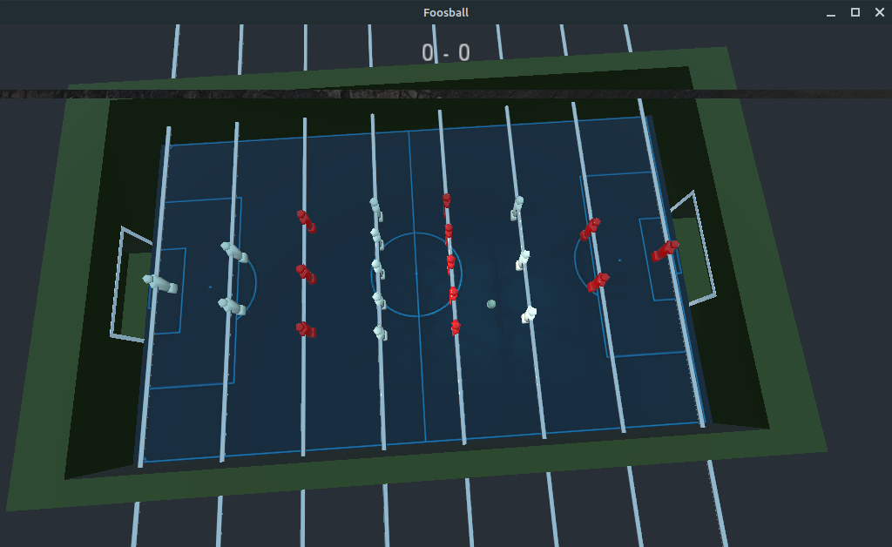

Foosball 3d
===========

This is a simple project to explore Godot as a game engine.

It is intended as a casual party game, best played with 4 people
(like real foosball), where each player has their own xbox-like
controller and control two bars with the analog sticks.

